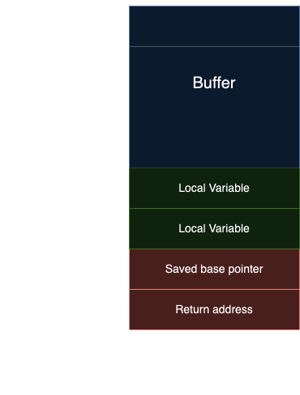

# **CUHK CTF 2024**
## `pwn`: Binary Exploitation

Exploiting low-level behaviour for our own good :)
*Made by F21endSh1p with ❤️*

---

<!-- _class: invert small -->

# Code of Ethics
- The exercises in this session should be attempted ONLY INSIDE THE SECLUDED LAB ENVIRONMENT documented or provided. Please note that most of the attacks described in the slides would be ILLEGAL if attempted on machines that you do not explicit permission to test and attack. You should bear responsibilities for any actions performed outside the secluded lab.
- The challenge server should be regarded as a hostile environment. You should not use your real information when attempting challenges.
- Do not intentionally disrupt other students who are working on the challenges or disclose private information you found on the challenge server (e.g. IP address of other students). Please let us know if you accidentally broke the challenge.

---

# What is `pwn`?
- Low level programs like C, *operate with data directly from memory without abstractions*, and allow programmer to manage memory manually.
- When the memory was handled incorrectly, bugs may occur to allow attackers control contents of the memory. Parts of memory influences program control flow, once controlled the computer will be directed to executing what the attacker wants.
- **Binary Exploitation** (`pwn`) is the hijacking of low level programs.

<!-- I will refer Binary Exploitation as `pwn` in the later session -->
---

# Why `pwn`?
- `pwn` is hard... but that is the fun!
- `pwn` challenges require attackers to understand and control the program as **sets of CPU instructions**
- Once successfully exploited *usually* you can take full control of the program:
  - **Reading / Writing** arbitrary data
  - **Running** arbitrary code

<!-- Depending on the permissions, you will be able to look at files, shutdown the computer,
etc. But at the very least, you can you a hacked computer to mine crypto. -->

---

# **Buffer Overflow Vulnerability**
<!-- Before I start, I hope you have learned some C programming -->

---

# Origins

*Starting simple, we enter our name into the program...*
1. To read strings, we need a *region* of memory to hold them, since they are quite long.
2. So, we allocate a piece of memory to store the string, known as a **buffer**.
3. When more memory is written than what is allocated*, **buffer overflow** occurs.

<!-- *: I will explain more why they allowed this to happen. -->

---

# So, what is *Buffer Overflow*?

> More data is wrote into the buffer than the buffer can hold.

*Very simple, right?*

---

<!-- I know what you are thinking, when you know you have a fixed memory length, just
don't read that much! But C programmers, back in the day, took convenience first, and
implemented `gets`. -->
<!-- Anyone heard of `gets`? Did they tell you not to use it? -->

# Why it happened

1.  Implementations of string reading functions (especially `gets`) lacks bounds checking, i.e. checking whether the memory allocated is large enough to store the data inputted.
2.  When the user inputs a string that is too long, `gets` simply accepts it and keeps writing *pass the end of the buffer*.

---

<!-- Why the fck do they create `gets`? -->
> It was back in the day, when if you told a user to only type 30 characters, they would only type 30 characters. People were honorable and there only 100 computers existed and you personally knew every computer programmer and user.

-- [u/FigBug](https://www.reddit.com/r/programming/comments/7zdg2/comment/c07tkft/?utm_source=share&utm_medium=web3x&utm_name=web3xcss&utm_term=1&utm_content=share_button)

---

### **It writes pass the buffer, so what?**
We can use it to hijack the program! How, exactly?
***Let's introduce, the stack!***

---

<!-- Most of the times, if the variable is not too large, it is stored in the stack. -->
### Anatomy of a stack

- Variables (indicated by `...` are stored at the top of the stack)
- Return address to the caller function is stored below.
<!-- We need to know where to, return once our function is done, right? -->
- The whole set is known as the *stack frame*.

*x86 stack shown here*

---

<!-- Not the anime, of course -->
# Overflow!

When user enters too many characters, `gets` overruns the buffer and writes data to the space for return address.

---

# Stack overflow exploits
- The data that is writing into the memory is usually just our input, unmodified. We can **precisely control what to write in which part of the memory.**
- The *structure* of the stack stays the same. We can calculate where to include our return address (a.k.a. *the offset*) and be sure it will be in the right place every time.

---

<!--footer: If you are using windows, maybe you can try `telnet` or `ncat`-->

# Demo

- Source: https://github.com/FearlessSniper/cuhk24ctf-workshop
- Challenge: `nc workshop.f21endsh1p.me 9999`

*Pwn it to win a can of coffee!*

---

# More Buffer Overflow

1. [From Missingno to Heartbleed: Buffer Exploits and Buffer Overflows](https://youtu.be/rE5dW3BTpn4?si=fiIwxVejfd_FTyov)
2. [Running a Buffer Overflow Attack - Computerphile](https://youtu.be/1S0aBV-Waeo?si=icStUTQSWhdYVXii)

---

# Read more `pwn`

- [ir0nstone: Cybersecurity Notes](https://ir0nstone.gitbook.io/notes)
- [CTF Wiki](https://ctf-wiki.org/pwn/linux/user-mode/environment/)
- [CTF 101: Binary Exploitation](https://ctf101.org/binary-exploitation/overview/)
- [Azeria Labs (ARM)](https://azeria-labs.com/)

---

# Keywords
- Stack Overflow
- Heap Overflow
- Use After Free
- Double Free
- GOT table
- Format String Vulnerability
- ROP (Return Oriented Programming)

---

# Tools

#### Exploit tools / Solve script development
- pwntools
#### Decompilation / Gadget Finding
- Binary Ninja
- IDA Pro
- ROPGadget
